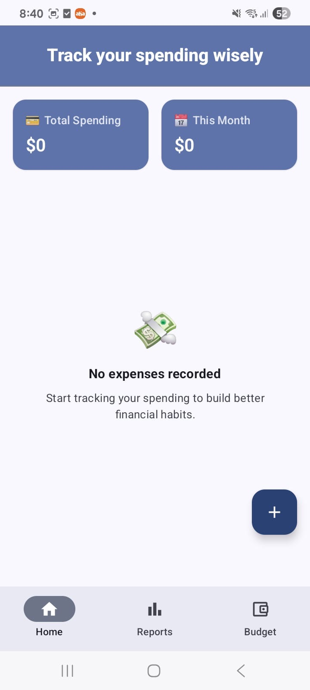
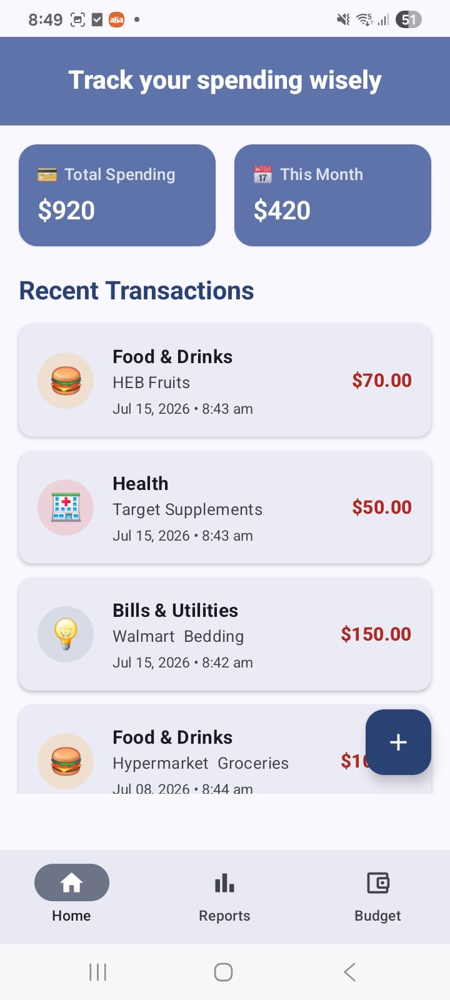
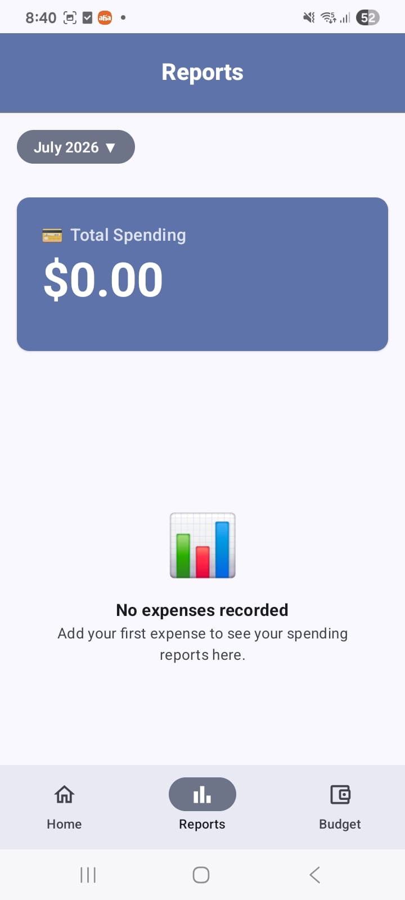
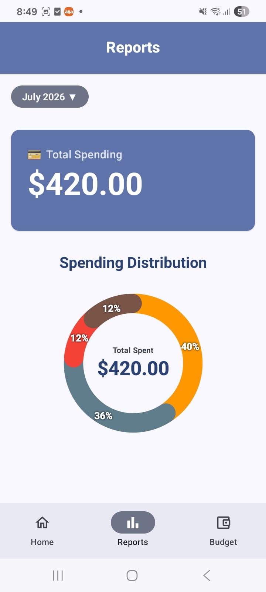
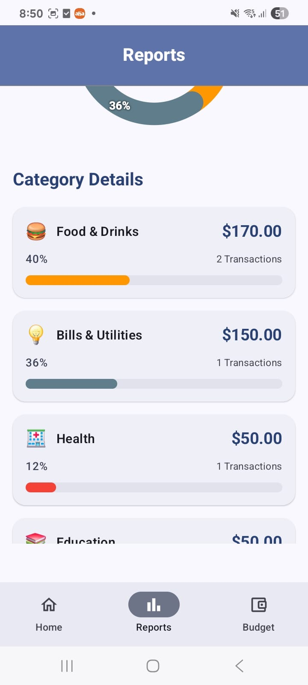
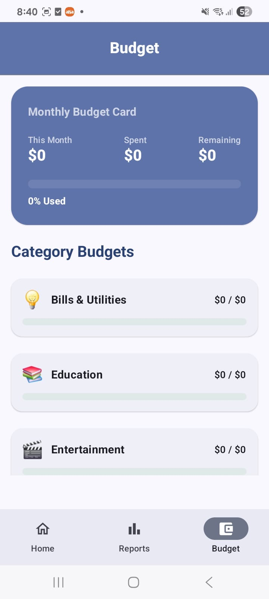
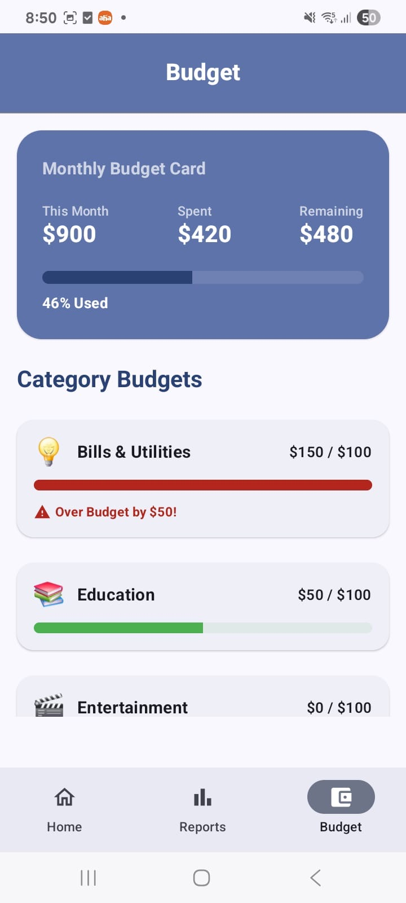
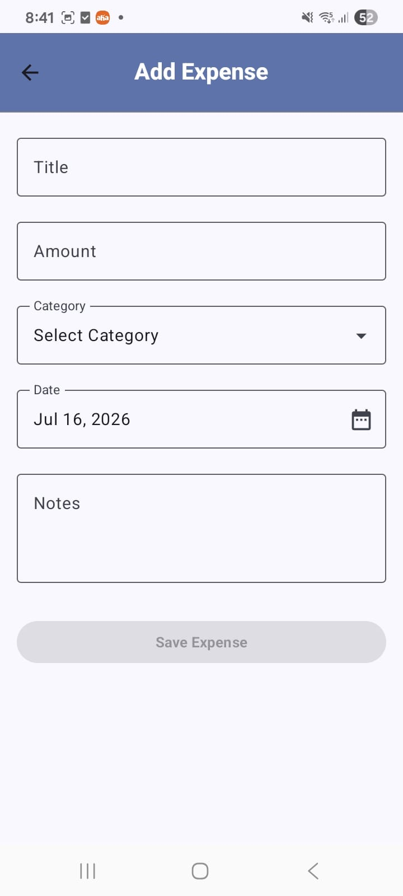
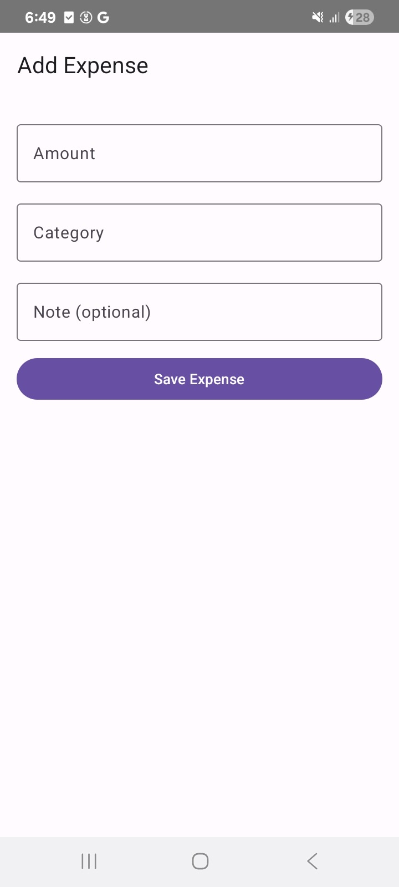
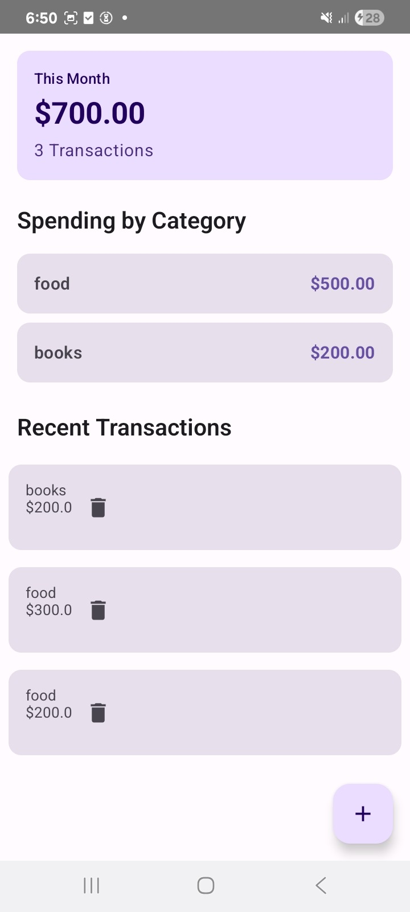

# Smart Expense Tracker App

A modern Android application built using **Kotlin**, **MVVM Architecture**, **Room Database**, and **Jetpack Components** to help users efficiently manage and track their daily expenses.

---

## 📱 Project Overview

Smart Expense Tracker is a personal finance management application that allows users to record, view, and manage their expenses. The application demonstrates modern Android development best practices and follows a clean architecture approach.

This project was developed as part of my Android Developer portfolio to showcase skills in Android application development using Kotlin and Jetpack libraries.

---

## 🚀 Key Features

### 📊 Visual Financial Insights
- **Interactive Pie Chart**: Real-time spending distribution with animated percentage labels for every category.
- **Spending Trends**: Instant comparison logic that tracks if you are spending more or less than the previous month.
- **Dynamic Date Filtering**: Custom date range selection using a modern Material 3 DateRangePicker to analyze specific time periods.

### 💸 Smart Expense Management
- **Categorized Tracking**: Organize spending into custom categories (Food, Transport, Health, etc.) with unique icons and colors.
- **High-Precision History**: Recent transactions are displayed with exact date and time stamps for better recall.
- **Effortless Entry**: A streamlined "Add Expense" flow with category bottom sheets and custom notes.
- **Swipe-to-Action**: Native swipe-to-dismiss functionality for quick and intuitive record deletion.

### 🎨 Modern UI & Performance
- **Jetpack Compose**: 100% declarative UI for a fluid, responsive, and state-driven interface.
- **Material 3 Design**: Leveraging the latest Android design system for a premium look.
- **Optimized for Speed**: Reactive UI updates powered by Kotlin Coroutines and StateFlow.
- **Offline Reliability**: Full data persistence using Room Database, ensuring the app works perfectly without an internet connection.

---

## 🛠 Tech Stack

### 📱 UI & Design
- **Jetpack Compose**: 100% declarative UI toolkit for modern Android development.
- **Material Design 3 (M3)**: The latest evolution of Google's design system.
- **Custom Canvas**: Used for high-performance interactive charts.

### 🏗 Architecture
- **Clean Architecture**: Clear separation of concerns between Data, Domain, and UI layers.
- **MVVM Pattern**: Robust state management using ViewModels.
- **Use Cases**: Encapsulated business logic for better testability and reusability.
- **Repository Pattern**: Abstracted data access logic.

### 📦 Data & Persistence
- **Room Database**: Type-safe local data persistence.
- **Kotlin Serialization**: Efficient JSON handling (if applicable).

### 🚀 Core Libraries
- **Hilt (Dagger)**: Standardized dependency injection.
- **Kotlin Coroutines & Flow**: For reactive programming and asynchronous task handling.
- **Jetpack Navigation**: Type-safe navigation between Compose screens.

### 🛠 Tools
- **Android Studio**: Latest IDE version for professional development.
- **Git & GitHub**: Version control and project management.

---

## 📂 Project Structure

```text
com.sandhya.expensetracker
│
├── data                  # Data Layer
│   ├── local             # Room DB, DAOs, Entities
│   └── repository        # Repository implementations
│
├── domain                # Domain Layer (Business Logic)
│   ├── model             # Clean data models
│   ├── repository        # Repository interfaces
│   └── usecase           # Reusable business logic units
│
├── ui                    # UI Layer (Jetpack Compose)
│   ├── component         # Reusable UI widgets
│   ├── screen            # Feature-based screens (Home, Reports, etc.)
│   ├── state             # UI state models
│   └── theme             # M3 Color, Shape, and Typography
│
├── di                    # Dependency Injection (Hilt Modules)
│
└── MainActivity.kt       # Single Activity Entry Point
```

---

## 🏗 Architecture Flow

```text
       [ UI Layer ]                [ Domain Layer ]             [ Data Layer ]
  Jetpack Compose Screens  ──▶  Use Cases (Business Logic)  ──▶  Repositories
           │                           │                          │
           ▼                           ▼                          ▼
       ViewModels  ◀───────────────────┴────────────────────  Room Database
    (State Management)                                       (Local Persistence)
```

---

## 📸 Screenshots

### Home Screen Empty
<p align="center">
         <a href="./screenshots/home_empty_screen.jpeg">
            
         </a>
</p>

### Home Screen with Expenses
<p align="center">
         <a href="./screenshots/home_with_expenses_screen.jpeg">
            
         </a>
</p>

### Report Screen Empty
<p align="center">
         <a href="./screenshots/reports_empty_scrceen.jpeg">
            
         </a>
</p>

### Report Screen with PieChart
<p align="center">
         <a href="./screenshots/reports_with_pie_chart_screen.jpeg">
            
         </a>
</p>

### Report Screen with Category Details
<p align="center">
         <a href="./screenshots/reports_with_category_details_screen.jpeg">
            
         </a>
</p>


### Budget Screen Empty 
<p align="center">
         <a href="./screenshots/budget_empty_screen.jpeg">
            
         </a>
</p>

### Budget Screen with Budgets
<p align="center">
         <a href="./screenshots/budget_with_expenses_screen.jpeg">
            
         </a>
</p>

### Add Expense Screen
<p align="center">
         <a href="./screenshots/add_expense_screen.jpeg">
            
         </a>
</p>

[//]: # (### Home Screen)

[//]: # (<p align="center">)

[//]: # (         <a href="./screenshots/home.JPG">)

[//]: # (            )

[//]: # (         </a>)

[//]: # (</p>)

[//]: # ()
[//]: # (### Add Expense Screen)

[//]: # (<p align="center">)

[//]: # (         <a href="./screenshots/add.JPG">)

[//]: # (            )

[//]: # (         </a>)

[//]: # (</p>)

[//]: # ()
[//]: # (### Expense History Screen)

[//]: # (<p align="center">)

[//]: # (         <a href="./screenshots/expenses.JPG">)

[//]: # (            )

[//]: # (         </a>)

[//]: # (</p>)

---

## ⚙️ Installation

### Clone Repository

```bash
git clone https://github.com/sandhyakarthik/SmartExpenseTrackerApp.git
```

### Open Project

1. Open Android Studio
2. Click Open Existing Project
3. Select SmartExpenseTrackerApp

### Build Project

```bash
Sync Gradle
```

### Run Application

```bash
Connect Android Device or Emulator
Run App
```

---

## 🧪 Skills Demonstrated

- Android App Development
- Kotlin Programming
- MVVM Architecture
- Room Database
- Repository Pattern
- Coroutines
- Git & GitHub
- Material Design
- Clean Code Principles

---

## 🎯 Future Enhancements

- **AI Spending Insights**: Predictive analysis of future spending based on history.
- **Export to PDF/CSV**: Generate professional financial statements.
- **Cloud Sync**: Firebase integration for cross-device data synchronization.
- **User Authentication**: Secure login and multi-user profile support.
- **Push Notifications**: Smart reminders for budget limits and daily logging.
- **Biometric Lock**: Enhanced security using fingerprint or face unlock.

---

## 📈 Learning Outcomes

- Implementing **Clean Architecture** to maintain a scalable codebase.
- Mastering **Jetpack Compose** for building high-performance, reactive UIs.
- Advanced state management using **Kotlin Flow and StateFlow**.
- Dependency Injection with **Hilt** to improve testability.
- local data persistence and complex queries with **Room**.

---

## 👩‍💻 Author

**Damerla Sandhya**

Android Developer

### Connect with Me

- GitHub: https://github.com/sandhyakarthik
- LinkedIn: will Add my LinkedIn Profile

---

## ⭐ Support

If you found this project useful, please give it a star on GitHub.
